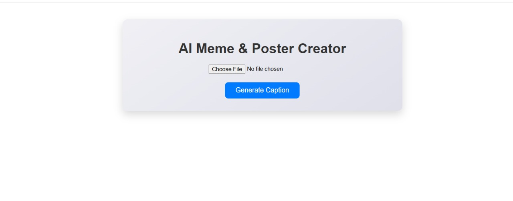
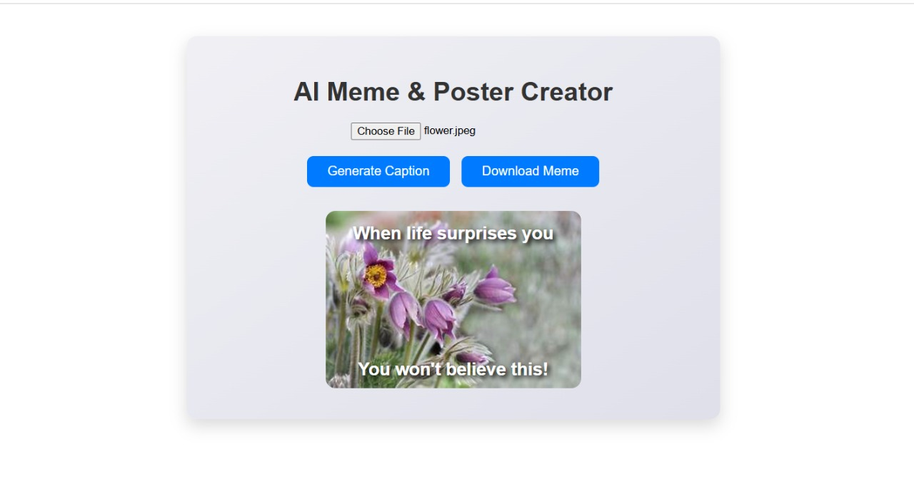
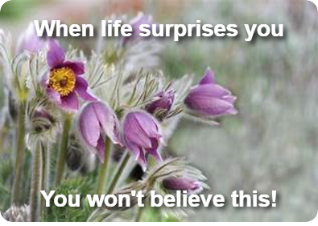

# 🖼️ AI Meme & Poster Generator

An AI-powered web app that automatically generates funny meme captions for any image!
Built using **React (Frontend)** and **Express.js (Backend)**, and deployed on **Netlify** and **Render**.

---

## 🚀 Features

* Upload any image from your device
* Generate **AI-based random meme captions**
* Download your created meme as an image
* Responsive and user-friendly interface
* Backend API integrated with AI caption generator logic

---

## 🛠️ Tech Stack

**Frontend:** React, HTML5, CSS3, JavaScript
**Backend:** Node.js, Express.js
**Deployment:** Netlify (frontend), Render (backend)

---

## 🧩 Project Structure

```
ai-meme-poster/
│
├── backend/
│   ├── src/
│   │   └── index.js
│   ├── package.json
│   └── .env
│
├── frontend/
│   ├── src/
│   │   ├── App.jsx
│   │   ├── main.jsx
│   │   └── App.css
│   │
│   ├── package.json
│   └── public/
│
└── screenshots/
    ├── meme.jpg
    ├── meme2.jpg
    └── meme3.png

```

---

## ⚙️ Setup Instructions

### 1️⃣ Clone the repository

```bash
git clone https://github.com/Tulasi-Ganta/ai-meme-poster.git
cd ai-meme-poster
```

### 2️⃣ Setup backend

```bash
cd backend
npm install
```

Create a `.env` file inside `backend/`:

```
PORT=8000
GEMINI_API_KEY=your_api_key_here
```

Run locally:

```bash
npm start
```

The backend will run on:

```
http://localhost:8000
```

### 3️⃣ Setup frontend

```bash
cd ../frontend
npm install
npm start
```

The frontend will run on:

```
http://localhost:5173/
```

---

## 🌐 Deployment Links

* **Frontend (Netlify):** [https://dashing-boba-9b6a2b.netlify.app](https://dashing-boba-9b6a2b.netlify.app)
* **Backend (Render):** [https://ai-meme-poster-2.onrender.com](https://ai-meme-poster-2.onrender.com)


---


## 🧠 API Endpoint

**POST** `/api/generate-caption`

**Request body:**

```json
{
  "imageDescription": "A funny cat"
}
```

**Response:**

```json
{
  "top": "When life surprises you",
  "bottom": "You won't believe this!"
}
```

---

## 📸 Screenshots

| Upload Image                        | Generate Caption                        | Download Meme                           |
| ----------------------------------- | --------------------------------------- | --------------------------------------- |
|  |  |  |

---
